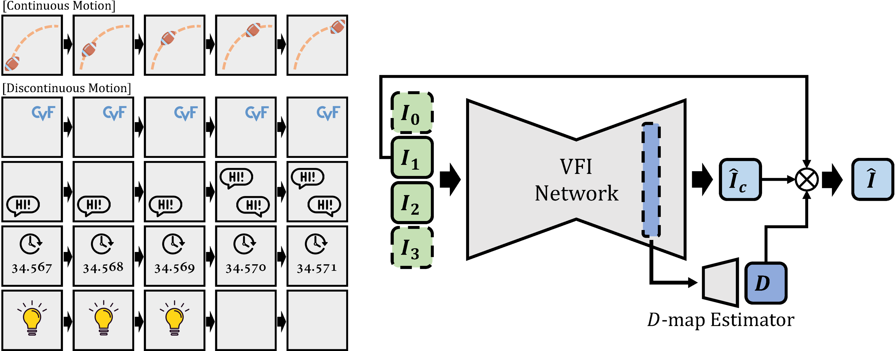

# [CVPR 2023] Exploring Discontinuity for Video Frame Interpolation

This is the official PyTorch implementation of our paper:

> **Exploring Discontinuity for Video Frame Interpolation** \
> [Sangjin Lee&#42;](https://github.com/pandatimo), [Hyeongmin Lee&#42;](https://github.com/HyeongminLEE), [Chajin Shin](https://github.com/ChajinShin), Hanbin Son, Sangyoun Lee (&#42;Equal Contribution)*\
> IEEE/CVF Conference on Computer Vision and Pattern Recognition (CVPR) 2023, **Highlight***

[[Paper(Arxiv)](https://arxiv.org/abs/2202.07291)]
## Overview


## Abstract
We propose three techniques that can make the existing deep learning-based VFI architectures robust to practical videos that contain various unnatural objects with discontinuous motions. First is a novel data augmentation strategy called figure-text mixing (FTM) which can make the models learn discontinuous motions during training stage without any extra dataset. Second, we propose a simple but effective module that predicts a map called discontinuity map (D-map), which densely distinguishes between areas of continuous and discontinuous motions. Lastly, we propose loss functions to give supervisions of the discontinuous motion areas which can be applied along with FTM and D-map. We additionally collect a special test benchmark called Graphical Discontinuous Motion (GDM) dataset consisting of some mobile games and chatting videos. Applied to the various state-of-the-art VFI networks, our method significantly improves the interpolation qualities on the videos from not only GDM dataset, but also the existing benchmarks containing only continuous motions such as Vimeo90K, UCF101, and DAVIS.

## Dataset
We construct a new test set called Graphic Discontinuous Motion (GDM) dataset which consists of high resolution videos of game scenes with abundant discontinuous motions. The dataset can be downloaded at: [[Google Drive](https://drive.google.com/file/d/1CbeGLPq91aaAun2ZvHIigJ9S_94bztMG/view?usp=sharing)]

## Useage

## Note
Code, Dataset and models are **only available for non-commercial research purposes.**

If you have any questions, please feel free to contact me :)
```
sglee97@yonsei.ac.kr
```

## Citation
```
@article{lee2022beyond,
  title={Beyond natural motion: exploring discontinuity for video frame interpolation},
  author={Lee, Sangjin and Lee, Hyeongmin and Shin, Chajin and Son, Hanbin and Lee, Sangyoun},
  journal={arXiv preprint arXiv:2202.07291},
  year={2022}
}
```
